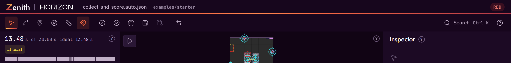
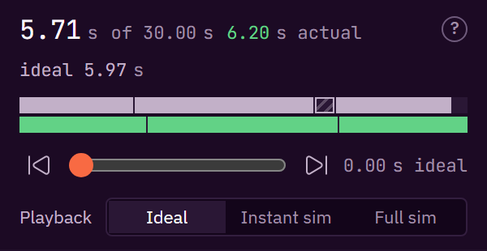
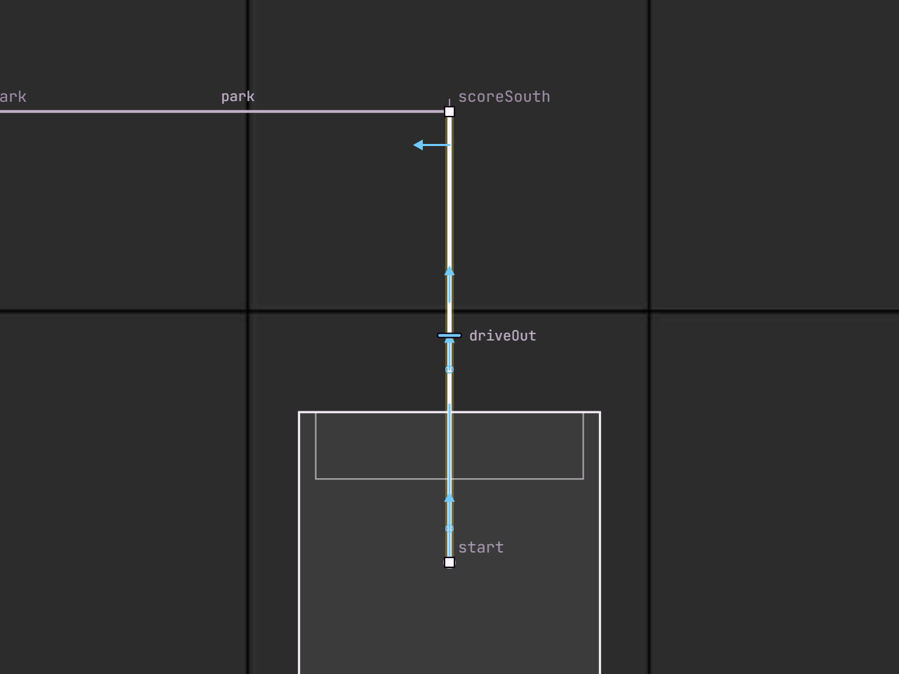
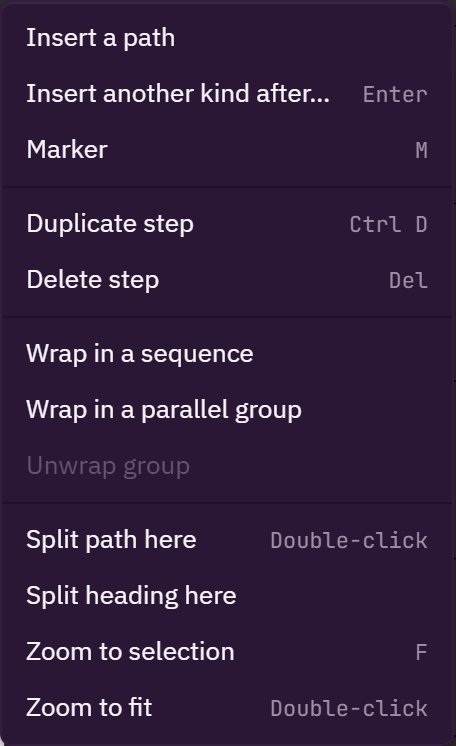
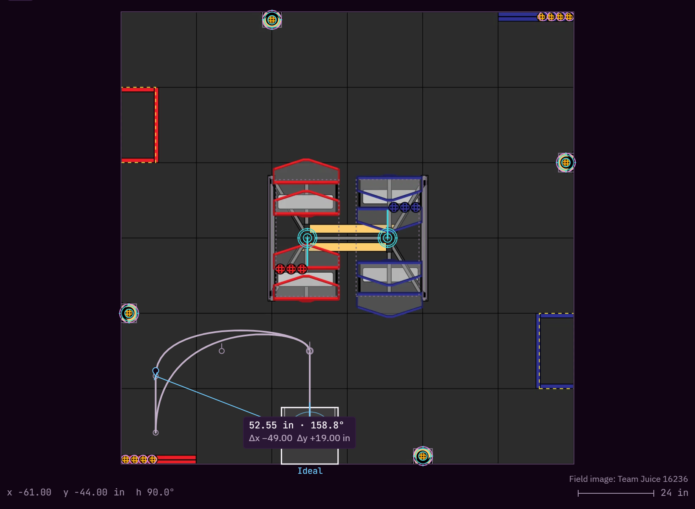
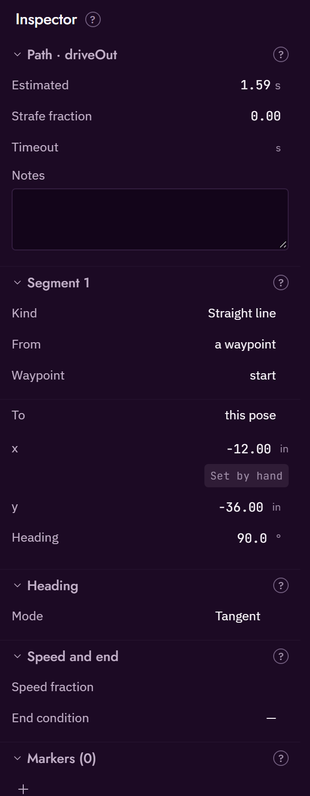
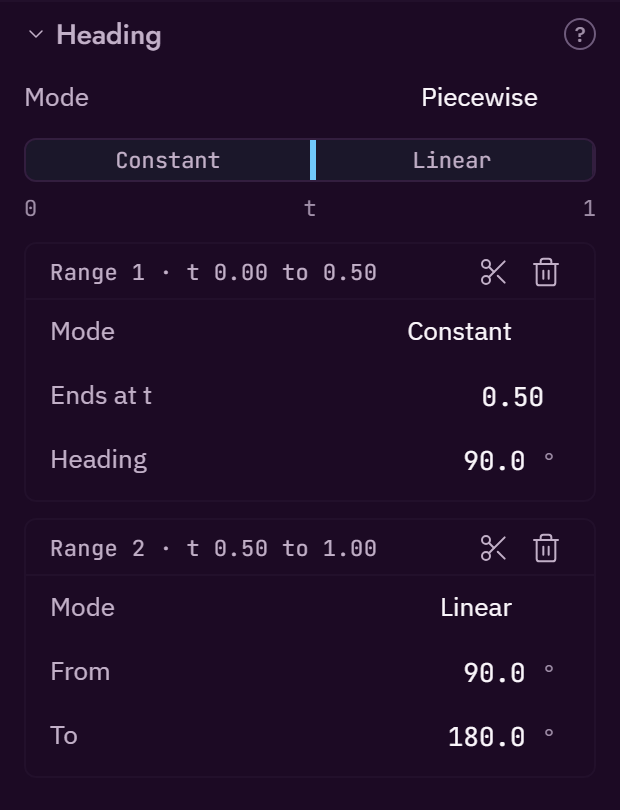
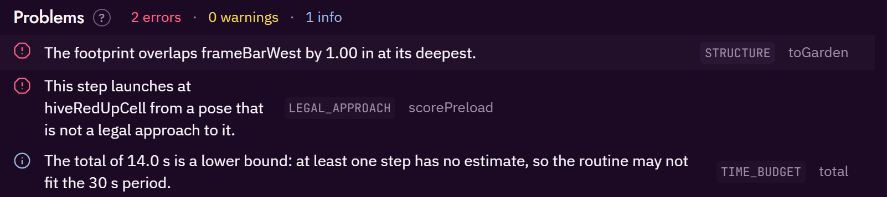
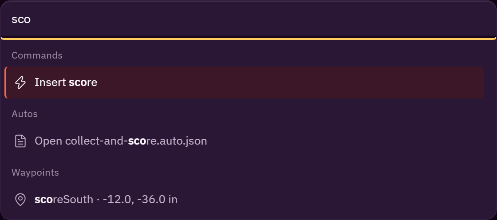

# The editor

This page describes every part of the Zenith editor: the tools, the panels, the inspector, the canvas gestures and the keyboard shortcuts. The desktop app and the web app share the same editor; where one has something the other does not, this page says so.


## Layout

The window has one main region, the field, with panels round it:

```
┌ title bar ·········································································┐
│ toolbar: tools │ actions │ view                                                   help │
├──────────────────┬──────────────────────────────────────────────┬──────────────────────┤
│ timeline         │                                              │ inspector            │
│ steps            │                  the field                   │                      │
│                  ├──────────────────────────────────────────────┤                      │
│ ledger (folded)  │ problems                                     │                      │
└──────────────────┴──────────────────────────────────────────────┴──────────────────────┘
```

Every panel title and every inspector section has a small `?` next to it. Hover it, focus it with the keyboard, or click it to pin it open: it says in a sentence or two what that part is for. Some also have a **Show me** link that starts the tour at that feature.

Panel edges can be dragged to resize the columns. `F6` moves keyboard focus from one region to the next.

## Title bar

The title bar shows the Horizon mark, the word Zenith, the name of the open auto, and the folder or GitHub repository and branch it came from. A dot after the name means there are unsaved changes. On the right is the alliance pill (RED or BLUE), and in the desktop app the window controls.

## Toolbar



The toolbar has three groups. Every button has a tooltip with its name, what it does and its shortcut. A disabled button's tooltip says why it is disabled.

**Tools** (one is active at a time):

| Tool | Key | What it does |
|---|---|---|
| Select | `V` | Click to select a point, a path or a marker, and drag to move it. |
| Add path | `P` | Click the field to drive to that point, continuing from the selected step. |
| Marker | `M` | Click a path to fire a command at that point without stopping. |
| Heading | `H` | Drag the heading arrow nearest the pointer on the selected path. |
| Measure | `U` | Drag between two points to read the distance and the angle. |
| Snap | `S` | A toggle, not a tool: points stop at waypoints, walls and the grid, and headings at 15°. |

**Add command** (`C`) is also a tool, reached from its shortcut and the command palette: click the field to add a command from the robot's code after the selected step.

**Actions:**

| Action | Key | What it does |
|---|---|---|
| Validate | `F8` | Re-check the routine now. Zenith also checks after every edit. |
| Play | `Space` | Animate the robot along the routine. |
| Simulate | `F5` | Run the robot repository's own simulator and lay the recorded drive over the plan. |
| Save | `Ctrl S` | Write the auto back to the robot repository. On a read-only project, Save downloads the file instead. In GitHub mode it asks for a commit message first. |
| Propose | `Ctrl Shift Enter` | Commit the auto and a picture of it to a work branch, and open a pull request. See [Working with GitHub](github.md). |

The desktop app adds three more actions to this group: **Run high-fidelity sim**, **Deploy autos into the robot repo** (it shows which files change first), and **Commit, push and open a pull request**. They are not shown in the browser.

**View:**

| Control | Key | What it does |
|---|---|---|
| Mirror to the other alliance | `A` | Show the routine as the other alliance would run it. You still edit one side. |
| Help | | The help menu: take the tour, show me everything, keyboard shortcuts, search actions. `?` or `F1` opens the keyboard shortcuts directly. |

## Steps panel

The Steps panel lists the routine in the order the robot runs it, top to bottom. Each row shows the step's kind icon, its name, a small bar for its estimated time, and a dot in the colour of the worst problem on that step, if any.

- Click a row to select the step. Its path is drawn brighter on the field and its settings open in the inspector.
- Drag a row by its handle to reorder it, or to move it into or out of a group. `Alt + ↑` and `Alt + ↓` do the same from the keyboard.
- Groups (sequence, parallel, branch) show a chevron and indent the steps they hold.
- **+ Insert step** at the end of the list, or `Enter`, opens the insert menu.

### The insert menu

The insert menu adds a step straight after the selected one. A new path starts where the selected step ends, so you can add to the middle of a routine and the steps after it are joined up again (or flagged if they cannot be).

| Kind | What it adds |
|---|---|
| Path | Drive to a new point, starting where the selected step ends. |
| Command | Run an action from your robot's code, such as the intake or the launcher. |
| Wait | Pause for some seconds, or until a sensor says something happened. |
| Sequence | A block of steps that run one after another. |
| Parallel | Steps that run at the same time: all, race or deadline. |
| Branch | Do one thing if a condition is true and another if it is not. |

Existing steps can be wrapped in a sequence or a parallel group, or unwrapped, from the right-click menu. The command palette also has **Wrap in a branch**. [Step kinds](step-kinds.md) explains each kind.

## Timeline and playback



The timeline sits above the steps. It shows each step's time as a bar against the 30 second autonomous period, and a scrubber you can drag to move the robot through the routine.

The **Playback** control under the scrubber picks what the robot on the field, the scrubber and the bars run on. There are three levels, and **Ideal** is the default:

| Level | What plays |
|---|---|
| Ideal | The planned path exactly, with no wobble or overshoot, timed by the estimate. Where a step does not start where the last one ended, the robot turns or drives across the gap. |
| Instant sim | Zenith's own follower and drivetrain model, run after every edit: a rough idea of how the robot really drives the path. |
| Full sim | The robot repository's own simulation, from a trace it wrote. Disabled until a trace is loaded. |

Hover a level for what it means, or a disabled one for why it is disabled. The robot's label on the field, the total and the playhead readout name the level they show, such as `ideal 13.48 s`. [Simulation](simulation.md#playback-levels) says more about each level.

- **Solid bars** are estimates. At the Ideal level they are the estimate's own bars, with a **hatched block** wherever the robot turns or drives across a gap before a step. At the Instant sim level the sim's time is the main bar, with the kinematic estimate as a band beneath it.
- **Striped bars** have no estimate, usually because a command's duration is not declared in the robot file.
- **Green bars** are a recorded run from a simulation, laid over the plan.


Press `Space` (or Play) to play and pause. `,` and `.` step the playhead back and forward a tenth of a second.

### The instant sim

Zenith has a built-in simulator that follows each path the way the robot's path follower does, within the robot's speed, acceleration and turning limits from `robot.json`. It runs again after every edit, fast enough to keep up with a drag. Choose **Instant sim** under the scrubber to play its result; the timeline then shows its preview bars. It needs no setup.

The **Simulate** button and the desktop app's **Run high-fidelity sim** run the robot repository's own simulator instead, which is slower and closer to the real robot. See [Simulation](simulation.md).

## The field

The field is the large region in the middle. It shows the field from above, with the routine drawn on it.

- Paths are thin light lines. The selected step's path is brighter and thicker.
- When a step is selected, or the pointer is over it, its **handles** appear: filled squares for end points and hollow squares for curve control points. You can drag any path's handle straight away, without selecting the step first; one undo puts it back.
- The selected step also shows its **heading arrows**, in light blue, which belong to its heading mode rather than to a point:
  - **Constant**: an arrow at each end. They are one angle, so turning either turns both.
  - **Linear**: a start arrow and an end arrow, each turned on its own.
  - **Tangent** and **Reverse tangent**: dashed arrows that show the way the robot faces. The path decides them, so they cannot be dragged; hover one to see why.
  - **Facing point**: the point itself, a ring with a cross, which you drag like a point.
  - **Piecewise**: the same arrows for each range, and a tick across the path at each boundary between ranges. Drag a tick along the path to move the boundary. Right-click a path and choose **Split heading here** to cut the heading into two ranges.


- Heading arrows snap to 15° steps. Hold `Shift` for 45° steps, `Alt` to turn freely, and `Ctrl` to flip the snap toggle.
- **Markers** are small pins on a path. Their names appear on hover.
- One **robot outline** shows where the robot is at the scrubber's time, or where the cursor is hovering on a path. It is drawn at the robot's real footprint, intakes included.
- The cursor's position and a scale bar sit in the bottom corners of the field.
- Field element labels (such as the names of the hives and flowers) are hidden until you hover them, or turn labels on.

### Field views and styles

**Field view** cycles between three ways of drawing the field:

| View | What you see |
|---|---|
| Image and outlines (the default) | The field picture, with the outlines of the walls, elements and zones the checks use drawn over it. |
| Image | The field picture alone. |
| Vector | The outlines alone, with a grid (12 inch minor lines, 24 inch major lines). |

**Field style** switches the field picture between the looks the field file provides, such as dark, black and light. It is disabled when the field has only one picture.

The BIOBUZZ field images are by Team Juice 16236.

### Canvas gestures and modifiers

These are the gestures the field understands. The table is taken from the editor's own gesture list (`CANVAS_HELP` in `apps/web/src/canvas/help.ts`), which the tour and the shortcut sheet also read.

| Gesture | What it does |
|---|---|
| Click | Select a point, a marker or a path. |
| `Shift` + click | Add a point to the selection, or take it out. |
| Drag on empty field | Draw a box and select every point inside it. Hold `Shift` to add to the selection. |
| Drag a point | Move it, even on a step that is not selected; a selected point carries the others. |
| `Esc` | Clear the selection, the measurement or an open menu. |
| Hold `Ctrl` while dragging | Flip the snap toggle for this drag: snap when it is off, move freely when it is on. |
| Hold `Alt` while dragging | Turn off the grid and the 15° heading steps only; waypoints and walls still snap. |
| Hold `Shift` while dragging a point | Move along one field axis only. |
| Hold `Shift` while turning a heading | Turn in 45° steps. |
| Hold `Shift` while dragging a curve handle | Move this handle alone, without swinging the one opposite it. |
| Drag a point near a wall | The robot rests flush against the wall, intakes included, so it never leaves the field. |
| Drag a heading arrow | Turn the path's heading: a Constant's two arrows turn together, a Linear's start and end turn apart. |
| Drag a tick across the path | Move the boundary between two heading ranges along the path. |
| Right-click a path, Split heading here | Cut the heading into two ranges there, each with its own mode. |
| `S` | Make the selected curve point smooth: its two handles stay in a line. |
| `C` | Make the selected curve point a corner: its handles move on their own. |
| Right-click | Open the menu for a point, a path or the field. |
| Double-click a path | Add a point there, splitting the segment in two. |
| Click or double-click the field (Add path tool) | Add a path point, continuing from the last one or from the step you are inserting after. |
| Hover a path | Show the robot there, with how far along the step it is and when it gets there. |
| `U`, then drag | Measure the distance and angle between two points. `Shift` keeps the angle to 45° steps. |
| `Space` + drag, or middle-drag | Pan the field. |
| Scroll | Zoom about the pointer. |
| `F` | Zoom to the selection, or to the whole routine when nothing is selected. |
| Double-click empty field | Fit the whole field in view. |

While you drag, a small readout next to the cursor shows x and y in inches, the heading in degrees, and which snap is acting. Snap and measure guides disappear when you let go. Nothing on the field moves by itself except playback.

### Snapping

With **Snap** on (`S` in the toolbar), a dragged point stops at named waypoints, at walls and at the grid, and a heading stops at 15° steps. The modifiers above change this for one drag: `Ctrl` flips snapping, `Alt` keeps waypoint and wall snapping but drops the grid and the 15° steps, and `Shift` keeps a point to one axis.

**Wall snap** uses the robot's full footprint: the body and every intake mouth. A pose snapped to a wall sits flush against it without crossing it, so it never produces a "leaves the field" problem.

### Smooth and corner points

A point where two curve segments meet is either **smooth** or **corner**. A smooth point keeps its two handles in a straight line, so dragging one swings the other and the path flows through without a kink. A corner point lets each handle move on its own, so the path can change direction sharply. Press `S` or `C` with the point selected, or use the right-click menu. Holding `Shift` while dragging a handle breaks the mirroring for that one drag.

### Selection and marquee

Click to select one point, `Shift` + click to add or remove points, or drag on empty field to draw a box round several. Dragging any selected point moves all of them together. The arrow keys nudge the selection by half an inch, and `Shift` + arrows by two inches. `R` and `Shift R` turn the selected point's heading by 5° one way or the other.

### The context menu



Right-click shows the actions that apply to what is under the pointer. Each item shows its shortcut, and a disabled item says why.

| Right-click on | Menu items |
|---|---|
| A point | Insert a path, insert another kind after, duplicate step, delete step, wrap in a sequence, wrap in a parallel group, unwrap group |
| A path | Insert a path, insert another kind after, marker, duplicate step, delete step, wrap in a sequence, wrap in a parallel group, unwrap group |
| A marker | Delete marker |
| Empty field | Add a path to here, add path, measure, snap, field view, field style |

After these, the field adds its own items where they apply, such as smooth or corner point, split the path here, and zoom.

### The measure tool



Press `U` (or click Measure), then drag between two points on the field. The readout shows the distance in inches and the angle in degrees. Hold `Shift` to keep the angle to 45° steps. `Esc` clears the measurement. `M` is not used for measure because it picks the Marker tool.

## Inspector



The inspector shows every setting of the selected step. Values are plain text until you hover or focus them, when the input appears. Numbers can also be changed by dragging sideways on them (`Shift` for faster, `Alt` for finer) or with `↑` and `↓`. Each number shows its unit, and poses show a provenance label, such as "Set from editor" or "Needs measurement". Click the label to change it.

The sections depend on the kind of step:

Step
:   The step's kind and id, how long it is expected to take, an optional time limit (timeout), and notes for your team.

Start of the routine
:   Where the robot is placed on the field before autonomous begins. Folded by default.

Segment 1, Segment 2, …
:   One leg of the drive each: where it starts, where it ends, and whether it is a straight line or a curve with control points.

Heading
:   Which way the robot faces while it drives, by Pedro Pathing's names: Tangent, Reverse tangent, Constant, Linear, Facing point or Piecewise. Hover a mode for what it means and the Pedro call it makes. Piecewise shows a track of the path from t 0 to 1 with a block per range: click the track to split a range there, drag the line between two blocks to move the boundary, and set each range's mode, values and end below it. Hovering a range lights up its stretch of the path. See [heading modes](paths-explained.md#heading-modes).

    

Speed and end
:   How fast this drive goes, as a share of the robot's top speed, and an optional sensor condition that ends it early. Also shows read-only values such as the estimated time and the fraction of the path driven sideways.

Markers
:   Commands that fire partway along this path, each with where it fires (a fraction of the way along, a distance from the start, or a distance before the end) and which command it runs.

Command
:   The command to run, from the list in `robot.json`, and its settings.

Wait
:   A number of seconds, or a sensor condition to wait for.

Sequence
:   Steps that run one after another as a single block.

Parallel group
:   Steps that run at the same time, and how the group ends: all, race or deadline (and which step is the deadline).

Branch
:   The condition, and the steps to run when it is true and when it is not.

When nothing is selected, the inspector says "Nothing selected." and asks you to click a step or a point on the field.

## Problems panel



The Problems panel, below the field, lists everything Zenith noticed that could go wrong on the real field, worst first. Its header shows the counts, such as `3 errors · 5 warnings · 2 info`; click a count to show or hide that severity.

Each row has a severity icon, the message as a plain sentence, a short code (such as `PERIMETER`), and the name of the step it belongs to.

- **Click a row** to select its step and pan the field to it. The part of the path with the problem is highlighted.
- **Hover the code** for what it means and how to fix it.
- **Fix buttons** appear on the row when Zenith knows the fix, such as "Make tangent" or "Slow this sweep". One click applies it, and `Ctrl Z` undoes it.

When the routine is clean the panel reads "No problems found." with the time the check took. The panel can be collapsed to its header. [Checks and findings](checks-and-findings.md) lists every code.

## Ledger

The ledger, at the bottom of the left column, shows what the robot is holding after each step: game pieces collected and scored. On BIOBUZZ that is pollen collected from flowers and launched into hives. It is how Zenith knows a launch has something to launch and the robot is not carrying more than it can.

The ledger starts folded, showing a one-line summary (for example "4 pollen collected, 3 launched"). Open it for a row per step, with the end-of-auto state grouped under its own heading.

## Command palette



`Ctrl K` opens a search over every action, command, waypoint and auto in the project. Type part of a name, move with the arrow keys and press `Enter` to run it. Each result shows its shortcut, so the palette is also a way to learn them. Actions that have no button, such as switching the theme, opening robot settings or loading the bundled example, are found here.

## Keyboard reference

These are the editor's shortcuts, from its shortcut table (`apps/web/src/app/shortcuts.ts`) and key table (`apps/web/src/app/keymap.ts`). Press `?` or `F1` in the editor for the same list. `Ctrl` is `Cmd` on a Mac.

!!! note "Checked against v0.1.0"
    This table was written from the v0.1.0 source. If a key here does not do what it says, the
    shortcut sheet in the editor (`?`) is the authority, and please open an issue.

| Key | What it does |
|---|---|
| `V` | Select tool |
| `P` | Add path tool |
| `C` | Add command tool (on the field, with a curve point selected: make it a corner point) |
| `M` | Marker tool |
| `H` | Heading tool |
| `U` | Measure tool |
| `S` | Turn snap on or off (on the field, with a curve point selected: make it a smooth point) |
| `A` | Mirror to the other alliance |
| `F` | Zoom to the selection, or the whole routine (field focused) |
| `Enter` | Insert a step after the selected one |
| `Del` or `Backspace` | Delete the selected step (or the selected marker) |
| `Ctrl D` | Duplicate the selected step |
| `Ctrl Z` | Undo |
| `Ctrl Y` or `Ctrl Shift Z` | Redo |
| `← ↑ → ↓` | Move the selected point by half an inch |
| `Shift` + arrows | Move the selected point by two inches |
| `R` / `Shift R` | Turn the selected point's heading 5° one way or the other |
| `Alt + ↑` / `Alt + ↓` | Move the selected step up or down the list |
| `Alt + ←` / `Alt + →` | Slide the selected marker along its path |
| `Space` | Play or pause |
| `,` / `.` | Step the playhead back or forward 0.1 s |
| `F8` | Validate |
| `F5` | Simulate |
| `Ctrl S` | Save |
| `Ctrl Shift Enter` | Propose (open a pull request) |
| `Ctrl O` | Open project |
| `Ctrl K` | Command palette |
| `F6` | Move focus to the next panel |
| `?` or `F1` | Keyboard shortcuts and help |
| `Esc` | Close a menu, clear the selection or measurement, or leave the tour |

While you are typing in a field, `Ctrl Z`, `Ctrl Y` and `Ctrl D` act on the text, not the routine.
