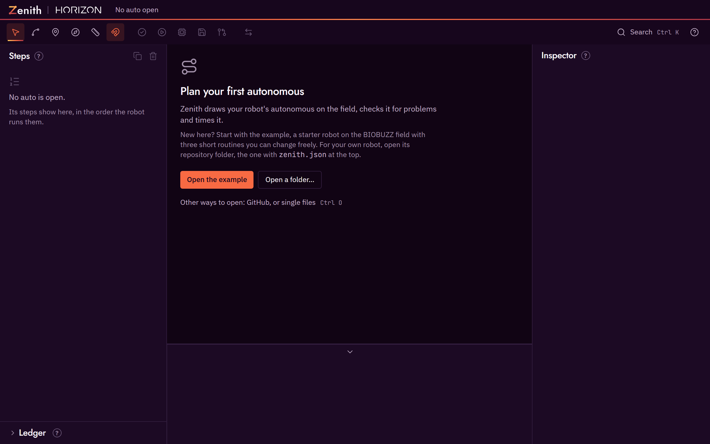
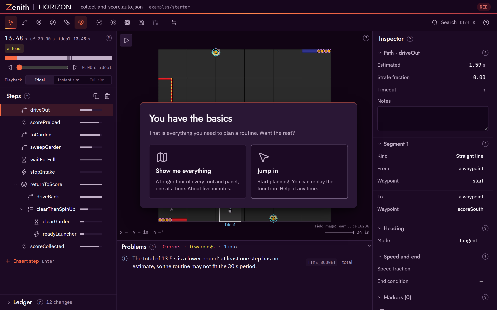

# Getting started

There are two ways to run the editor: the Windows desktop app, or the web app in a browser. Both are the same editor. Pick one, take the short tour, then plan a first auto on the starter example.

| | Desktop app | Web app |
|---|---|---|
| Install | Download from GitHub Releases | None |
| Opens a robot project folder | Yes | Yes, in Chrome or Edge |
| Saves in place, reloads on outside edits | Yes | Saves in place when the browser allows it |
| High-fidelity sim, deploy, commit and pull request buttons | Yes | No |
| Platforms | Windows | Any desktop browser |

## Install the desktop app

1. Open the [Zenith releases page](https://github.com/Horizon-36596/zenith/releases) and find the newest release.
2. Download one of the two Windows files:
    - `Zenith-Setup-0.1.0.exe` installs Zenith and adds it to the Start menu.
    - `Zenith-Portable-0.1.0.exe` runs without installing, for example from a USB stick.
3. Run the file you downloaded.

The desktop app is not code-signed yet, so the first time you run it Windows SmartScreen shows a "Windows protected your PC" dialog. Click **More info**, check that the app name reads Zenith, then click **Run anyway**. Windows remembers the choice for that file. Code signing is planned for a later release; until then this step is expected, and it is the same for every unsigned download.

!!! tip "Download only from the releases page"
    The releases page on `github.com/Horizon-36596/zenith` is the only official source for the
    installer. A copy from anywhere else may not be the same file.

## Open the web app

Go to [libraries.horizon36596.org/zenith/app/](https://libraries.horizon36596.org/zenith/app/). There is no account and no install.

The web app can load the bundled example straight away. To open your own robot project folder, use a browser that supports the File System Access API, such as Chrome or Edge. In other browsers you can still load the example and download files you change.

!!! note "Your files stay on your machine"
    The web app is a static page. When you open a local folder, the browser reads and writes the files
    directly; nothing is uploaded.

## The first-run tour

When you first open Zenith, the welcome screen says "Plan your first autonomous" and offers two buttons: **Open the example** and **Open a folder…**. Open the example loads the starter example, a made-up robot on the BIOBUZZ field with four routines, and opens its `collect-and-score` routine. It is the best place to start. The link under the buttons, "Other ways to open: GitHub, or single files", opens the Open project dialog.

The first time something is open on the field, a short guided tour starts by itself. It rings one part of the editor at a time, with a card that says what that part is for. The tour does not lock the window: every button, menu, tooltip and drag works as usual while it runs, and the card moves out of the way of anything you open. Some stops ask you to try something, such as dragging a point; when you do it, the stop is ticked off.

The core tour has six stops:

1. **The field.** The FTC field from above, with the routine drawn on it. Try dragging one of the dots on the path.
2. **The steps.** The list of steps the robot runs, top to bottom. Try clicking one.
3. **Add a step.** Insert puts a new step straight after the selected one. Try adding a path.
4. **The inspector.** Every setting of the selected step: where it goes, which way the robot faces, how fast.
5. **Problems.** What Zenith found that could go wrong on the real field. Click a problem to jump to its step.
6. **Play and save.** Play shows the robot running the routine; Save writes the file back. Try pressing Space.

After the core tour a card titled "You have the basics" gives you a choice:

- **Show me everything** continues with a longer tour of every feature (about five minutes): each tool, the heading arrows (with a drag to try), snapping and the drag modifiers, heading modes, markers, groups, the timeline, the ledger, where numbers come from, one-click fixes, the other alliance, simulation, sharing through GitHub, right-click menus, the command palette and the shortcut sheet.
- **Jump in** closes the tour so you can start planning. Pressing Esc on this card does the same.

Keys on a tour card, while it has the keyboard focus: `→` or `Enter` for next, `←` for back, `Esc` to skip. Anywhere else the keys are the editor's own, so `Esc` closes a menu or clears the selection. The tour starts by itself only once. Replay it at any time from the help menu (**Take the tour** or **Show me everything**) or from the command palette (`Ctrl K`).

## Plan a first auto

This walk-through uses `first-auto`, the smallest routine in the starter example: drive out, score the four preloaded pollen, and park. You look at each of its three steps, then delete the last one and build it again yourself, so that what you save is the same routine as the shipped `examples/starter/autos/first-auto.auto.json`. The starter robot is a plain mecanum robot with one intake at the front and a fixed launcher. Every number in its files is a placeholder.

1. **Open the example, then `first-auto`.** On the welcome screen, click **Open the example**. It opens `collect-and-score`; if the tour starts, finish it or press `Esc`. Press `Ctrl K`, type `first-auto` and choose **Open first-auto.auto.json**. (`Ctrl O` also lists the example's autos under "Autos in examples/starter".) The Steps panel now lists three steps, `driveOut`, `scorePreload` and `park`, and the timeline shows how long each takes against the 30 second autonomous period.
2. **Look at `driveOut`.** Click `driveOut` in the Steps panel. The inspector shows **Segment 1** as a **Straight line** from **a waypoint**, `start`, to **a waypoint**, `scoreSouth`, and the **Heading** section's **Mode** is **Tangent** (`tangent` in the file; hover it to read what it means). The robot drives 27 in north from the south wall to a scoring spot south of the RED hive. **Estimated** reads 1.59 s.
3. **Look at `scorePreload`.** Click `scorePreload`. It is a command step: **Name** `score`, with `count` set to 4. `score` is marked stationary in the robot file, so it runs as its own step while the robot stands still. Its estimate, `0.5 + count * 0.5`, gives 2.50 s.
4. **Look at `park`.** Click `park`. Its segment goes from **last step's end** (`"current"` in the file) to **a waypoint**, `park`, again facing the way it drives. `"current"` means the path starts wherever `scorePreload` left the robot.
5. **Delete `park`.** With `park` selected, press `Del`. The routine now ends at `scoreSouth`.
6. **Add a path after `scorePreload`.** Click `scorePreload`, so the new step goes after it. Press `P` for the Add path tool, then click the `park` waypoint's mark on the field, at x −40, y −36, 28 in west of the robot. With Snap on, the point lands on the waypoint. A path step named `path` appears, and its segment already starts from **last step's end**. Press `V` to go back to the Select tool.
7. **Point it at the waypoint.** A click writes the point's numbers into the file, even when it snaps onto a waypoint. To refer to the waypoint by name, as the shipped file does, open **Segment 1** in the inspector, set **To** to **a waypoint**, then pick `park` under **Waypoint**. The file now says `{ "ref": "park" }`, so moving the waypoint later moves this path too.
8. **Check the heading.** In the **Heading** section, **Mode** reads **Tangent**, Pedro Pathing's name for it. That is `tangent`, the mode every new path starts with: the front of the robot, and its intake, faces the way it drives.
9. **Name it `park`.** Double-click `path` in the Steps panel, type `park` and press `Enter`. Ids are how findings, the timeline and traces point at a step.
10. **Play, check and save.** Press `Space` to play. The robot outline drives out, stands still to score, and drives to park; the timeline shows 1.59 s, 2.50 s and 1.62 s, about 5.7 s in all. The Problems panel below the field reads "No problems found." If it lists anything, click the problem to jump to its step and hover its code for what it means. Press `Ctrl S` to save. The bundled example is read only, so in the web app Save downloads `first-auto.auto.json`; in your own project folder it writes the file in place. The saved routine has the same steps, commands, waypoints and headings as the shipped file. Only the `park` step's note is missing; type one in its **Notes** box if you want it.

## Next steps

- [The editor](editor.md) covers every tool, panel, modifier and shortcut.
- [Autonomous paths, explained](paths-explained.md) explains poses, heading modes, curves, commands and markers.
- [Checks and findings](checks-and-findings.md) lists every problem Zenith can report and how to fix it.
- [Robot runtime](robot-runtime.md) shows how to run a saved auto on the robot, with Ivy or SolversLib commands. [Choosing a command library](command-libraries.md) says how to name the one your robot code uses.
