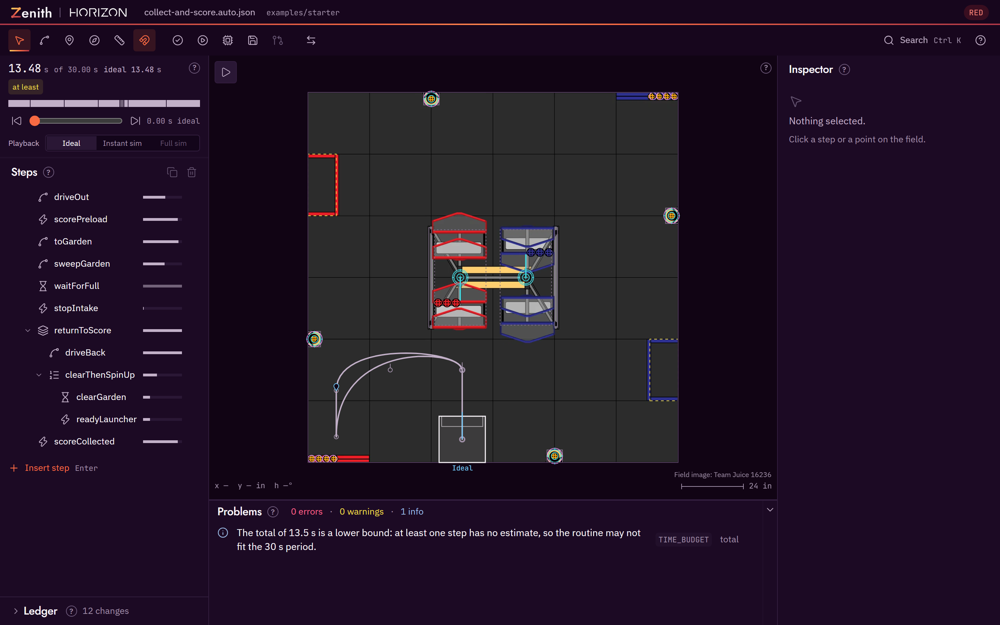

# Zenith

**Plan an FTC autonomous on the real field, see whether it will work, and run it on the robot without editing Java.**

Zenith is a PathPlanner-style autonomous path planner for FTC. People draw and edit routines in the editor, and AI agents edit the same files from the command line or over MCP, so both work on one plan and get the same checks. It is built by Horizon (FTC 36596).

*The editor with the starter example open: the steps on the left, the field in the middle, the inspector on the right and the problems panel below the field.*

!!! warning "Status: beta, v0.1.0"
    Zenith works end to end: draw, check, preview, save and run. File formats, command names and the
    editor layout may still change before 1.0. Pin the version you use, and read the
    [changelog](changelog.md) before you upgrade.

## What it does

- **Draw routines on the field.** Paths, headings, curves and robot commands, in the robot's own coordinate frame, with the robot drawn at its real size, intakes included.
- **Check them while you edit.** Every change is checked against the field walls, the field elements, the game rules, the 30 second autonomous period and what the robot can physically do. Problems appear as plain sentences, and many have a one-click fix.
- **Preview them.** A built-in simulator plays the routine on the field as you drag, so you can watch the robot drive before it ever touches the tiles.
- **Run them on the robot.** Each routine is one readable JSON file. The Zenith runtime on the robot reads the file and builds the routine at init, with Ivy or SolversLib commands, whichever your robot code uses, so a changed auto needs no Java edits. See [Choosing a command library](command-libraries.md).
- **Share and review.** Autos live in your robot repository, so they are diffed, reviewed and merged like any other code.

## Start here

### Desktop

Download the Windows installer from GitHub Releases and open a robot project folder directly. The desktop app adds a few actions the browser cannot do, such as running your robot repository's own simulator. [Install the desktop app](getting-started.md#install-the-desktop-app).

### Web

Open the web app in your browser at [libraries.horizon36596.org/zenith/app/](https://libraries.horizon36596.org/zenith/app/). There is nothing to install, and the bundled example loads with one click. [Open the web app](getting-started.md#open-the-web-app).

### Agents

Use Zenith from Claude Code or any MCP client. The CLI and the MCP server create, edit, validate, render and simulate the same auto files the editor saves, and return every finding as structured data. [Agents and MCP](agents-mcp.md).

## New to autonomous paths?

[Autonomous paths, explained](paths-explained.md) covers poses, headings, curves, commands and markers from the beginning, using the BIOBUZZ field as the example. Then [Getting started](getting-started.md) walks you through planning a first auto in ten steps.

## Licence

Zenith is released under the MIT licence, copyright Horizon (FTC 36596). You may use it, change it and share it, including in your own team's code and in commercial work. Keep the copyright notice and the licence text with any copy you pass on.

The BIOBUZZ field images are by Team Juice 16236. The bundled fonts are under the SIL Open Font Licence. The `NOTICE` file in the repository lists every third-party credit.
