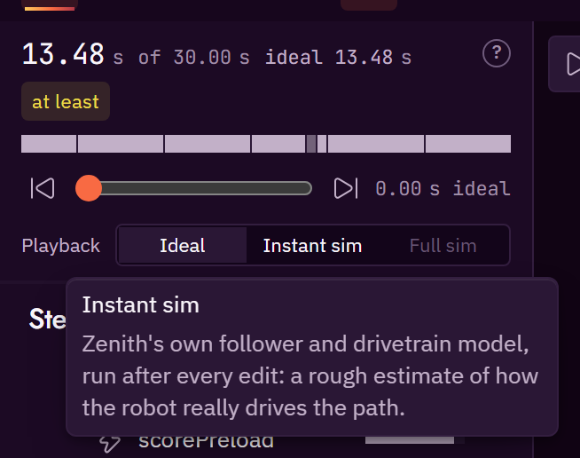

# Simulation

Zenith tells you how long a routine takes and where the robot goes before you put it on a field.
It has two simulators and one quick estimate:

| | where it runs | how fast | what it is |
|---|---|---|---|
| **Estimate** | everywhere: editor, CLI, MCP server | instant | a kinematic model of travel time. The checks and the time totals use it. |
| [**Instant preview sim**](#instant-preview-sim) | the editor, in the web and desktop apps | re-runs after every edit | a port of the Pedro v3 follower driving a model mecanum drivetrain. The Instant sim playback level uses it. |
| [**High-fidelity sim**](#high-fidelity-sim) | the desktop app and `zenith sim` | seconds to minutes | your robot repository's own headless simulator, running your real robot code |

The estimate and the preview come from Zenith and know only your files. The high-fidelity sim runs
your robot code. When they disagree, trust the high-fidelity sim, and use
[`zenith calibrate`](#calibrating-the-estimate) to bring the estimate closer.

## Playback levels

The robot you watch on the field can come from three places. Pick one with the **Playback** control
under the timeline's scrubber:

| level | the robot | the clock | use it for |
|---|---|---|---|
| **Ideal** (default) | on the planned path exactly, heading exactly as the heading mode says | the estimate | checking the plan itself, the way the public Pedro visualizer draws it |
| **Instant sim** | the [instant preview sim](#instant-preview-sim)'s robot, with its drift and overshoot | the preview sim | a rough idea of how the real robot drives it |
| **Full sim** | the recorded poses of a [high-fidelity sim](#high-fidelity-sim) trace | the trace | the closest match to the robot |



The choice is remembered with your other editor preferences. Ideal is the default on a first visit.

Everything that depends on the robot's simulated pose says which level it is from: the label under
the robot on the field, the total next to the timeline's time (`ideal 13.48 s`), the playhead
(`5.23 s ideal`), the time in the hover readout on a path, and the bars. The trace report in the
Simulate dialog, and the inspector's recorded time, are always the full sim's.

### Ideal

The ideal robot drives each path along its geometry with no wobble and no overshoot, at the speed
the [estimate](#the-estimate) gives each point, then holds the end pose for the settle time. A wait
or a command holds the pose for its estimated time. A `parallel` group follows the member that
drives, and a `branch` follows its `then` side for as long as the estimate says the branch takes.

Where a step does not start where the robot is, the ideal robot does not jump. A path whose `from`
is a literal pose away from the last step's end, or whose heading mode starts facing another way,
gets a **transition**: the robot turns and drives in a straight line to the path's start. It is
timed with the same model as a path, from rest to rest, and a pure turn takes the turn at
`maxAngularVelRadPerS`. On the field the transition is a thin dashed line. On the timeline it is a
hatched block before the step, and its tooltip says how far the robot drives and turns. So the ideal
total can be longer than the estimate's total by exactly its transitions.

### Instant sim

The Instant sim level is only offered once the preview sim has run the routine. If the preview
cannot run the routine, the option is disabled and its tooltip gives the reason.

### Full sim

The Full sim level needs a trace. The desktop app writes one when you run the high-fidelity sim. In
the web app, run your sim command in the robot repository and load the trace it writes from the
**Simulate** dialog (F5). Until a trace is loaded the option is disabled, and its tooltip says how
to get one. A remembered Full sim choice plays Ideal until a trace is loaded.

## The estimate

Pedro v3 is a geometric follower: it has no precomputed speed profile to read. So Zenith estimates
each path's time with a kinematic model, says what the model assumes, and calibrates it against
recorded runs.

For each path, sampled every 2 in along its length:

1. **Speed cap by direction.** The robot's top speed in its own frame is an ellipse with
   `maxForwardVelInPerS` nose-on and `maxStrafeVelInPerS` sideways, times the path's
   `speedFraction`. Driving sideways is slower.
2. **Braking.** The robot must be able to stop at the end. Stopping distance uses a deceleration
   between `forwardDecelInPerS2` and `strafeDecelInPerS2`, on the same ellipse. On most mecanum
   robots sideways braking is much weaker, which is why a strafing leg costs more than its top
   speed suggests.
3. **Acceleration.** `accelInPerS2`, starting from the previous step's end speed: zero after a
   stationary command, carried through when paths follow each other.
4. **Heading rate.** Where the heading mode asks for a turn faster than `maxAngularVelRadPerS`, the
   robot slows down until it fits.
5. **Curvature.** On a curve, speed is capped so the sideways acceleration stays within
   `strafeDecelInPerS2`. This is a proxy for how hard the drivetrain can hold a curve.
6. **Profile.** A forward and a backward pass over those caps give the speed at every sample, and
   the time is the sum of distance over speed.
7. **Settle.** `settleS` (0.25 s by default) is added for the follower to settle at the end.

Everything else:

- A `command` takes its `estimateS` from `robot.json`, or is marked unknown.
- A `sequence` costs the sum of its steps.
- A `parallel` group costs its longest member under `all`, its shortest under `race`, and its
  deadline member under `deadline`.
- A `branch` costs the longer of its two sides.

The estimate is a range: nominal, plus or minus a band. The band is ±20 % until a calibration sets
`kinematics.calibration.band` in `robot.json`. [`TIME_BUDGET`](checks-and-findings.md#time_budget)
compares both ends of the range with the autonomous period.

Run it on the command line with:

```bash
zenith estimate autos/first-auto.auto.json --explain
```

`--explain` prints the assumptions behind the numbers.

## Instant preview sim

The preview drives your routine through a model of the robot, tick by tick, and shows the result as
you edit. At the Instant sim [playback level](#playback-levels) it is what you watch when you press
play, what the robot follows when you scrub the timeline, and what fills the timeline's preview
bars. It re-runs after every edit, starting from the first step the edit changed, so an edit near
the end of a long routine costs only that end.

It is deterministic: the same files always give the same run, in the web app and the desktop app.

### What it models

**The follower.** The preview follows paths the way Pedro v3's ForesightV3 follower does, ported
from Pedro's own source:

- Each tick it projects where the robot would stop if it braked now, finds the closest point on the
  path to that projected pose, and drives along the path's tangent there.
- It brakes once the projected stop passes the end of the path.
- Translational correction pulls the robot back toward the path, with separate forward and strafe
  gains. Heading is corrected toward the heading mode's target.
- Drive, correction and heading powers are combined and scaled so no wheel passes full power, and
  braking power is capped.
- A path step ends when the follower passes 97.5 % of the last segment, while the robot may still
  be moving, as it does on the robot. The follower then holds the end pose. The time until the
  hold meets Pedro's end tolerances is reported separately as settle time.
- A `linear` heading turns each segment's share the short way, as Pedro does.

**The drivetrain.** Mecanum wheel powers from drive, strafe and turn; a first-order response for
each wheel; and a chassis that coasts down at `forwardDecelInPerS2` and `strafeDecelInPerS2` when
no wheel is powered. The turning limit follows `maxAngularVelRadPerS`, or the track width and wheel
base when `kinematics.drivetrain` gives them.

**The command tree.** Steps run in the same order the robot's scheduler runs them. Markers fire on
distance travelled, as the runtime's markers do. A `"current"` path starts from wherever the
simulated robot is. `parallel`, `sequence` and `branch` groups follow their rules on the
[Step kinds](step-kinds.md) page.

**Game state.** Conditions marked with a `ledger` in `robot.json` (`"full"` or `"empty"`) are
answered from what the robot holds. By default that is `hopperFull` and `hopperEmpty`.

### Where its numbers come from

The preview reads `robot.json`. The follower's gains and tolerances are the optional keys under
`kinematics.follower`, listed in the [file format reference](file-format.md#kinematics). Copy them
from your Pedro constants for the closest match to your robot. A key left out falls back to Pedro's
default, or to a value derived from your measured speeds and decelerations.

### Limits

The preview is a model that estimates. It does not simulate physics exactly, and it only knows what
your files tell it.

- **Default braking is gentle.** Without your Pedro brake coefficients, the preview brakes by
  coasting to rest. Real braking is shorter, so default stops run long.
- **Commands take their `estimateS`.** A command's mechanism is not simulated. A command with an
  `"unknown"` estimate takes one tick and marks the step unknown. A command marked `movesRobot` is
  marked unknown too.
- **Conditions it cannot see never fire.** A sensor condition with no `ledger` meaning never reads
  true, and the step is marked unknown. A `branch` on such a condition takes its `then` side.
- **Collection is approximate.** A path whose `endCondition` waits for a full hopper stops where the
  ledger says it fills, taking the pieces as evenly spaced along the path.
- **No contact.** The preview does not model the robot hitting field elements or pushing game
  pieces. The [checks](checks-and-findings.md) catch overlaps from the geometry instead.
- **It differs from the estimate.** The estimate runs each path to rest and adds `settleS`; the
  preview, like the robot, ends a path at 97.5 % while still moving. At high speed on short legs the
  preview is noticeably shorter. Calibration closes the gap.

## High-fidelity sim

The high-fidelity sim runs your robot repository's own headless simulator: your real command tree,
the real Pedro follower and your simulated hardware. Zenith starts it, waits, reads back a trace of
what happened, and draws it over the plan.

### Setting it up

Your robot repository needs a headless test that loads an auto file, runs it for the autonomous
period, and writes a trace. Tell Zenith how to run it in `zenith.json`. This is the starter
example's `sim` block:

```json
"sim": {
  "command": "./gradlew :TeamCode:testDebugUnitTest --tests \"*ZenithAutoHeadlessTest*\" -Dzenith.auto={auto}",
  "trace": "TeamCode/build/sim/{auto}.trace.json"
}
```

`ZenithAutoHeadlessTest` stands for your own test class. `{auto}` is replaced with the auto's name.
The name is validated first, the command runs without a shell, and the trace path must stay inside
the repository.

The test and the trace writer live in your robot repository. See
[Robot runtime](robot-runtime.md) for the runtime that loads auto files on the robot.

### Running it

**In the desktop app**, press **High-fidelity sim**. The app:

1. asks you to save first if the auto has unsaved edits, because the sim runs the file on disk;
2. runs the command and streams its output into a panel, with a cancel button;
3. reads the trace and draws the simulated path over the plan, fills the timeline with the actual
   times, and makes the Full sim playback level available.

The sim needs Java 17 or newer. The app looks at `JAVA_HOME`, then the `PATH`, and says so in plain
words if it finds none. The first run can take a few minutes while Gradle downloads dependencies.

The web app cannot start a local process, so it cannot run the high-fidelity sim. It can load a
trace the sim wrote, from the **Simulate** dialog, and play it at the Full sim level.

**On the command line:**

```bash
zenith sim first-auto
```

`--timeout <seconds>` stops a sim that hangs, `--open` also renders an SVG of the plan next to the
trace, and `--json` prints the report as JSON.

### The trace

The trace is a JSON file your robot repository's test writes. It holds each step's start and end
time, the robot's poses every tick, contacts with field structures, and the ledger. This is the
shape of a trace for the starter example's `first-auto`, cut down to its first pose. The step times
shown are the planner's estimates for those steps, not a recorded run; your sim writes its own.

```json
{
  "formatVersion": 1,
  "auto": "first-auto",
  "simTimeS": 32.0,
  "tickS": 0.02,
  "steps": [
    { "id": "driveOut", "startS": 0.0, "endS": 1.59, "interrupted": false },
    { "id": "scorePreload", "startS": 1.59, "endS": 4.09, "interrupted": false },
    { "id": "park", "startS": 4.09, "endS": 5.71, "interrupted": false }
  ],
  "poses": [ [0.00, -12.0, -63.0, 1.5708] ],
  "structureContacts": [],
  "ledger": [ { "timeS": 4.09, "held": 0, "launches": 4 } ],
  "events": [],
  "capabilities": ["structureContacts", "ledger"]
}
```

Each entry in `poses` is `[timeS, xIn, yIn, headingRad]`. `capabilities` lists what this sim build
can measure. A check whose capability is missing is reported as inert rather than passed.

### The report

For each step: estimated against actual time, and the largest distance between the planned path and
the recorded poses. For the whole run: total time, structure contacts (there should be none),
launches, and what the robot holds at the end.

!!! note "Headless harnesses differ from the robot"
    A headless harness is a model too. If yours does not report the robot's velocity to the
    follower, Pedro never projects a stopping distance and every stop overshoots by a few inches.
    The robot does not. Compare against a real-robot recording before you tune for a harness quirk.

## Calibrating the estimate

`zenith calibrate` fits the estimate's free numbers to recorded traces:

```bash
zenith calibrate --write
```

It reads every `*.trace.json` in `traces/` if your repository has that folder, otherwise in the
folder of `zenith.json`'s `sim.trace`. `--traces <dir>` picks another folder. It pairs each recorded
path step with the plan's step of the same `id`, then fits:

- `accelInPerS2`, the acceleration;
- `settleS`, the settle time at the end of a path;
- a scale for each heading mode (`tangent`, `constant`, `linear`), since legs that strafe behave
  differently from nose-first legs.

It prints the fit and the residual band: how far off the fitted estimate still is. Without
`--write`, nothing changes. With `--write`, it writes `accelInPerS2` and `settleS` into `robot.json`,
labelled `CALIBRATED FROM SIM <date> (<n> steps)`. `--date` sets the date in the label. The per-mode
scales are reported but not written yet.

### `CALIBRATED FROM SIM` and `CALIBRATED FROM ROBOT`

The fit is the same either way. The label says where the traces came from, and that changes how much
the number is trusted:

| label | traces from | trust tier |
|---|---|---|
| `CALIBRATED FROM SIM` | the high-fidelity sim | derived: as good as the sim |
| `CALIBRATED FROM ROBOT` | the real robot, recorded with the same trace writer running on the robot | measured |

A number fitted from the sim can only be as good as the sim's model of your drivetrain. A number
fitted from the real robot is a measurement. Recalibrate from the robot when you can.

!!! warning
    In v0.1.0, `zenith calibrate --write` always writes `CALIBRATED FROM SIM`. If your traces came
    from the real robot, change the label to `CALIBRATED FROM ROBOT` by hand.
